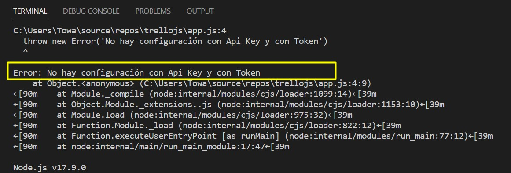

# Trello JS

## Inicializando este proyecto 

1.- Inicializamos un proyecto en nodejs con `npm init` 

2.- Agrega la siguiente dependencia que nos ayudará a tener configuración externalizada: `npm install dotenv --save`

3.- En caso de no tener la carpeta .env, al ejecutar `node app.js` mandara el siguiente error

**por eso para ejecutar este proyecto hay que crear este archivo con el Key y Token correspondiente de Trello**
- El archivo .env debe tener la escructura 

```
KEY="yourKeyFromTrello"
TOKEN="yourTokenFromTrello"
```

Nota. El key y el token es informacion sensible que no debe de versionarse en ningun repositorio.

4.- Agregamos la siguiente dependencia `npm install trello --save`

5.- Agregamos el siguiente codigo para instanciar Trello y agregar una targeta.

```
require('dotenv').config()

if(!process.env.TOKEN && !process.env.KEY){
  throw new Error('No hay configuración con Api Key y con Token')
}

let Trello = require("trello");
let trello = new Trello(process.env.KEY, process.env.TOKEN);

let cardTitle = `Card Nueva ${new Date()}`

trello.addCard(cardTitle, "LaunchX Card Description", 
    /* Lista de tareas */"629170687517e73a9256d81a",
	function (error, trelloCard) {
		if (error) {
			console.log('Could not add card:', error);
		}
		else {
			console.log('Added card:', trelloCard);
		}
	});
```

### Visita la documentacion de Trello para mas informacion https://developer.atlassian.com/cloud/trello/rest/api-group-boards/#api-boards-id-memberships-get